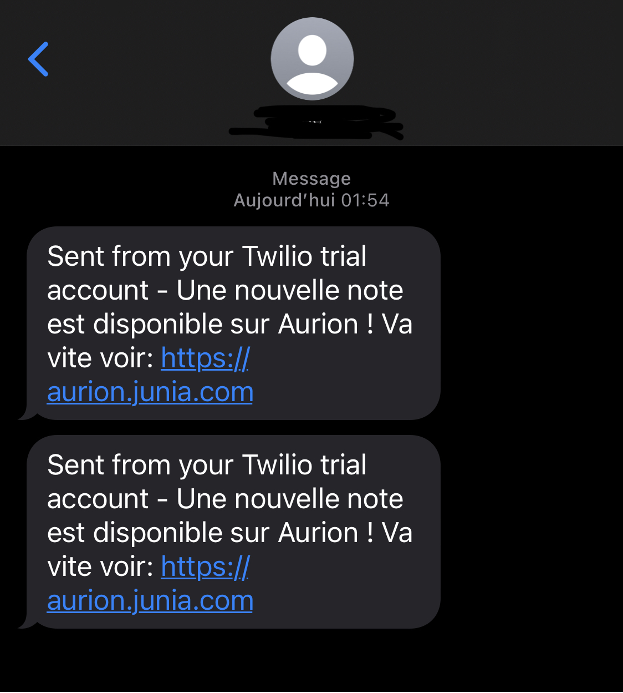

# Bot to get notified when a new grade is available on Aurion

This bot automatically connects every 20 minutes to Aurion to get the total number of grades. If this number is higher than the previous time, the bot will send you an SMS to warn you.



## Configuration

**Download the program**
Clone this project, move to the root, then run the following command to download all required libraries:

```
pip install -r requirements.txt
```

**Download the Chrome Driver**
This program uses Selenium to automate your web browser. You will need to have [Google Chrome](https://www.google.com/chrome/) installed.

You will also need to install a Chrome Driver. This program allows you to automate Google Chrome. Go to [this link](https://chromedriver.chromium.org/downloads), and select the Driver corresponding to your OS and version of Google Chrome. Save the file to the root of your computer (or a place you can easily find later).

**Create a Twilio account**
This program uses Twilio APIs to send an SMS when a new grade is available. All you have to do is create a [Twilio account](http://twilio.com).

**Setup environment variables**
To connect to your Aurion account, the program needs your login and password. These elements being private, you will have to store them in a secured place. To do this, create a file called `.env` at the root of the project and fill in the following values:

```
CHROME_DRIVER_PATH=path_to_your_chrome_driver

AURION_EMAIL=your_aurion_email
AURION_PASSWORD=your_aurion_password

TWILIO_ACCOUNT_SID=your_twilio_account_sid
TWILIO_AUTH_TOKEN=your_twilio_auth_token
TWILIO_PHONE_NUMBER=your_twilio_phone_number
MY_PHONE_NUMBER=your_phone_number
```

_Just add your information without any quotes._

## To run the bot

To start the bot, you just have to launch the Python program. Everything else is automatic.

## Recommendation

For this bot to be useful, it must be left running in the background. For that, I advise you to use a raspberry (or other) that you leave running permanently at home. That way the bot will warn you as soon as a new grade is available !
